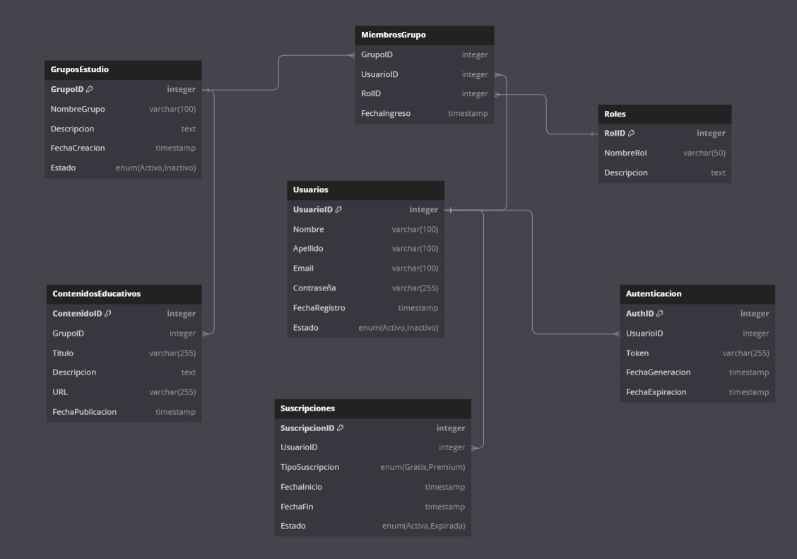
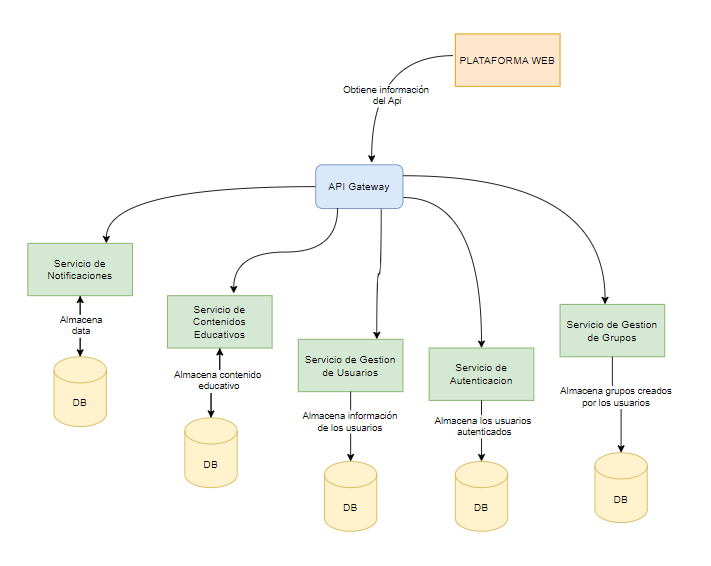

[Regresar al índice](../README.md)

## 3. Decisiones de Arquitectura

En esta sección se especificarán las decisiones tomadas con respecto a la arquitectura de software de la plataforma web educativa.

### 3.1. Asignación de Responsabilidades

La plataforma web educativa se compondrá de los siguientes módulos:

- **Módulo de usuario:** Se encargará de autenticar al usuario, gestionar su información y administrar las suscripciones premium.
- **Módulo de gestión de grupos:** Se encargará de mostrar y administrar los grupos de estudio del usuario, incluyendo la creación, modificación y eliminación de grupos.
- **Módulo de contenidos:** Se encargará de la gestión de contenidos educativos, permitiendo subir, modificar y acceder a recursos compartidos.
- **Módulo de administración de grupos:** Se encargará de las funciones de administración de los grupos de estudio, como la aceptación de nuevos miembros, la gestión de roles y la personalización del grupo.
- **Módulo de comunicación y notificaciones:** Se encargará del manejo de las comunicaciones y notificaciones entre los usuarios, incluyendo mensajes y avisos importantes.
- **Módulo de organización de reuniones:** Se encargará de la organización de reuniones y encuestas dentro de los grupos de estudio.

**Contexto:**  
La plataforma web educativa requiere una estructura clara y organizada para gestionar de manera eficiente las funcionalidades principales, como la gestión de usuarios, la administración de grupos de estudio, la gestión de contenidos y la seguridad de la plataforma.

**Alternativas:**  
1. **Monolítica:** Todas las responsabilidades se gestionan en un único componente de la aplicación.
2. **Microservicios:** Cada responsabilidad se asigna a un microservicio independiente.
3. **Modular:** La aplicación se divide en módulos separados, pero no en microservicios completamente independientes.

**Decisión:**  
Se elige la alternativa **Modular**. Esta decisión se basa en la necesidad de mantener una arquitectura organizada y escalable sin la complejidad completa de los microservicios.

**Criterio Asociado:**  
La modularidad permite una separación clara de responsabilidades, lo que facilita el mantenimiento y la actualización del sistema sin la sobrecarga de una arquitectura de microservicios. Además, permite que los equipos trabajen de manera más independiente en cada módulo.

### 3.2. Modelo de Coordinación

**Contexto:**  
La coordinación entre los diferentes módulos y componentes de la plataforma es esencial para asegurar la coherencia de datos y la correcta ejecución de procesos.

**Alternativas:**  
1. **Coordinación Centralizada:** Un único componente central coordina todas las interacciones entre los módulos.
2. **Coordinación Distribuida:** Cada módulo se coordina directamente con los demás módulos necesarios.
3. **Mediador:** Un patrón de mediador que facilita la comunicación entre los módulos sin que estos se comuniquen directamente.

**Decisión:**  
Se elige la alternativa **Mediador**. Un mediador gestionará la coordinación entre los módulos.

**Criterio Asociado:**  
El uso de un mediador reduce la complejidad de las interacciones directas entre módulos y facilita la gestión de cambios y actualizaciones. Además, permite una mayor flexibilidad y escalabilidad a medida que la plataforma crece.

Se implementará un modelo de coordinación utilizando tanto comunicación síncrona como asíncrona:

- **Comunicación síncrona:** Este tipo de comunicación se utilizará para operaciones como la autenticación, la obtención de información de los grupos de estudio y la modificación de contenidos.
- **Comunicación asíncrona:** Este tipo de comunicación se utilizará para la gestión de notificaciones, la organización de reuniones y la coordinación de actividades dentro de los grupos de estudio.

### 3.3. Modelo de Datos

**Contexto:**  
El manejo de datos en la plataforma debe ser eficiente y seguro, garantizando la integridad de los datos y la capacidad de realizar consultas eficientes.

**Alternativas:**  
1. **Base de Datos Relacional:** Uso de un sistema de base de datos relacional para estructurar y gestionar los datos.
2. **Base de Datos NoSQL:** Uso de una base de datos NoSQL para mayor flexibilidad y escalabilidad.
3. **Híbrido:** Uso de una combinación de bases de datos relacionales y NoSQL para aprovechar lo mejor de ambos mundos.

**Decisión:**  
Se elige la alternativa **Base de Datos Relacional**.

**Criterio Asociado:**  
La decisión se basa en la necesidad de manejar relaciones complejas entre los datos y realizar consultas eficientes. Las bases de datos relacionales son ideales para este tipo de tareas y ofrecen robustez y consistencia en el manejo de datos críticos para la plataforma educativa.

Se utilizarán bases de datos relacionales para asegurar la integridad y eficiencia en el manejo de datos.

- **Base de datos relacional (SQL):**
  - **Gestión de usuarios:** Manejo de información personal, suscripciones y autenticación.
  
  - **Detalles de grupos de estudio:** Información sobre los grupos, miembros, roles y configuraciones.
  - **Contenidos educativos:** Almacenamiento y gestión de recursos educativos compartidos en los grupos.

### 3.4. Mapeo entre Elementos de Arquitectura

### 3.5. Elección de Tecnología
### Front-end (React.js)

**Razones por la que se escogio:**
- **Componentización**: Facilita la reutilización de componentes y la organización del código.
- **Rendimiento**: Virtual DOM mejora la eficiencia en la actualización de la interfaz.
- **Comunidad y Ecosistema**: Amplia comunidad de desarrolladores, gran cantidad de librerías y soporte.

**Alternativas descartadas:**
- **Angular**: Mayor curva de aprendizaje y mayor complejidad.
- **Vue.js**: Menor adopción en grandes proyectos empresariales comparado con React.

### Back-end (.NET Core)

#### Razones por las que se escogió:

- **Rendimiento**: .NET Core ofrece un alto rendimiento y eficiencia, especialmente en aplicaciones de alta concurrencia y escalabilidad.
- **Ecosistema**: Amplia colección de bibliotecas y herramientas en NuGet.
- **Compatibilidad multiplataforma**: Permite desarrollar y ejecutar aplicaciones en diferentes sistemas operativos como Windows, macOS y Linux.
- **Escalabilidad**: Fácil de escalar tanto vertical como horizontalmente.

#### Alternativas descartadas:

- **Django (Python)**: Aunque es robusto y ofrece muchas características integradas, puede no ser tan eficiente en aplicaciones de alta concurrencia y en tiempo real.
- **Ruby on Rails**: Menor rendimiento comparado con .NET Core en aplicaciones de alta concurrencia y escalabilidad.

### Base de Datos (SQL Server)

**Razones por las que se escogió:**

- **Conocimiento del equipo**: El equipo de desarrollo tiene amplia experiencia y conocimiento en SQL Server.
- **Procedimientos almacenados (SP)**: Permite el uso de procedimientos almacenados, lo que puede mejorar el rendimiento y la seguridad de las consultas.
- **Integración con .NET Core**: Ofrece una excelente integración con el backend de .NET Core, facilitando el desarrollo y la implementación.
- **Escalabilidad y Rendimiento**: Alto rendimiento y capacidad de manejo de grandes volúmenes de datos.

**Alternativas descartadas:**

- **MySQL**: Aunque es una opción popular y eficiente, SQL Server ofrece características avanzadas como mejores herramientas de análisis y capacidades de almacenamiento que son esenciales para nuestras necesidades .
- **MongoDB**: Ideal para datos no estructurados, pero nuestras necesidades requieren capacidades relacionales fuertes, lo cual es una fortaleza de SQL Server .