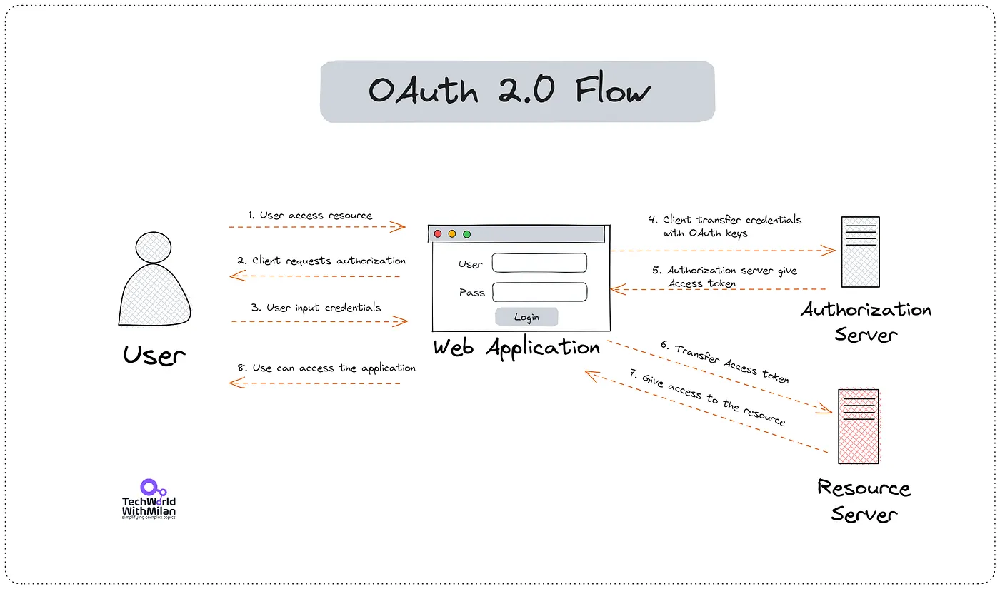
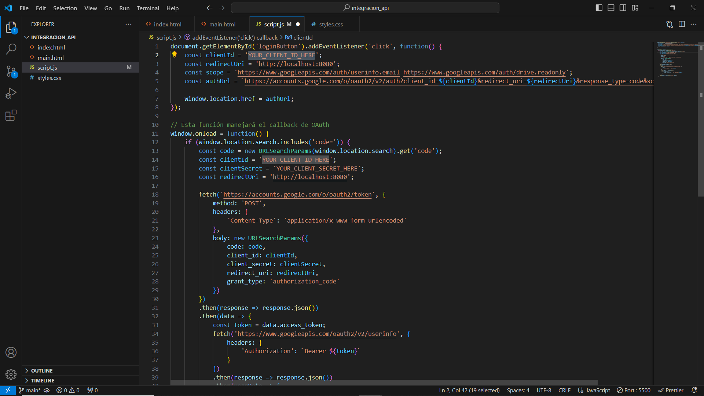
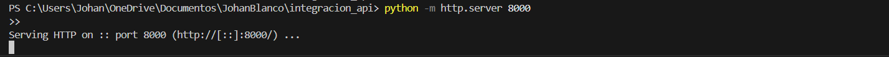
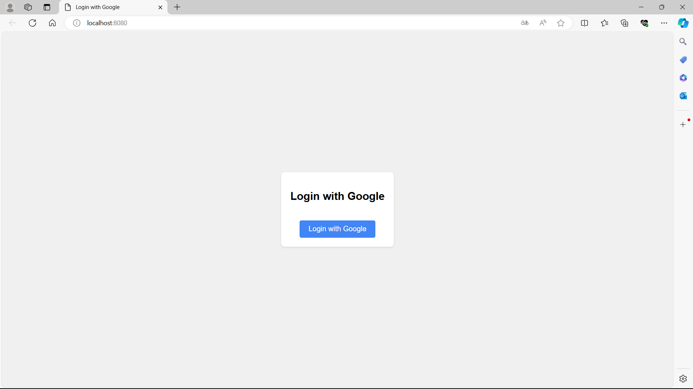
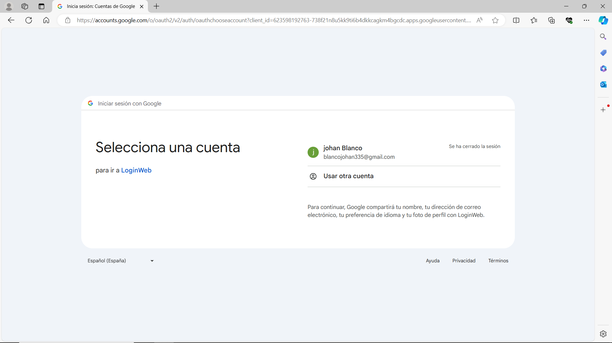
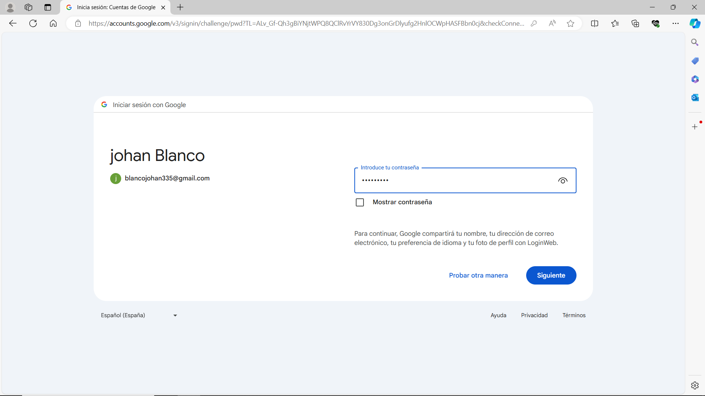
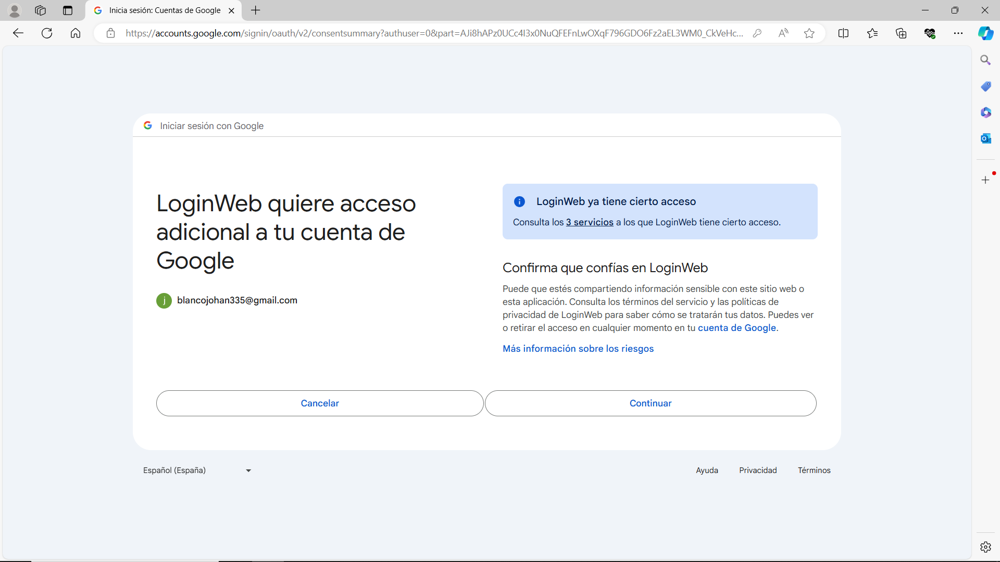
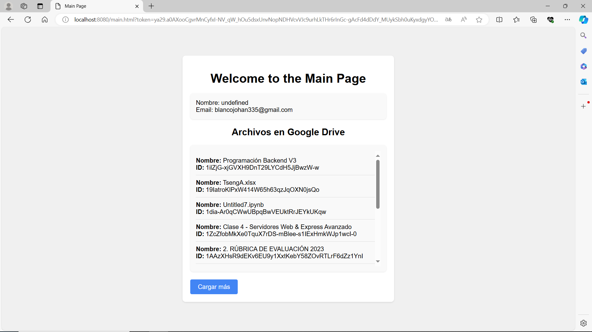

# **Tópicos en Arquitectura de Software**
## 1. Tema
Integración con APIs de Terceros
## 2. Desarrollo Conceptual
La integración de APIs de terceros permite a las aplicaciones ampliar sus funcionalidades mediante el uso de servicios externos. OAuth 2.0 es un estándar de autorización utilizado para conceder acceso limitado a las APIs de terceros sin compartir las credenciales del usuario. En este caso, hemos implementado la autenticación con Google utilizando el protocolo OAuth 2.0.

## 3. Consideraciones Tecnicas 
### 3.1 Instalación / Configuración de Servicio
Google Cloud Console:
#### 3.1.1. Crear un proyecto: 
- Accede a Google Cloud Console
- Crea un nuevo proyecto
#### 3.1.2. Habilitar la API de OAuth:
- Navega a API & Services > Library.
- Habilita Google OAuth API.
#### 3.1.3. Configurar credenciales de OAuth 2.0:
- Navega a API & Services > Credentials.
- Crea credenciales de OAuth 2.0, seleccionando Web Application.
- Establece la URI de redireccionamiento a http://localhost:8080/
#### 3.1.4. Obtener Client ID y Client Secret:
- Guarda el Client ID y el Client Secret que se generen.

### 3.2 Primeros pasos
Preparación del entorno:
#### 3.2.1 Instalar Python (si no está instalado):
- Descarga e instala Python desde la pagina oficial.
#### 3.2.2 Configurar un servidor local:
- Utiliza el servidor HTTP simple de Python para servir archivos HTML, CSS y JavaScript
- Navega al directorio del proyecto y ejecuta: python -m http.server 8080.
## 4. Demo
### 4.1 Escenario Práctico
Implementar una página web que permita a los usuarios autenticarse con Google mediante OAuth 2.0 y luego mostrar su información de perfil y listar archivos en Google Drive.
### 4.2 Pasos para la Demo
#### Configurar el Proyecto:
Crea los siguientes archivos en tu directorio del proyecto los cuales podras encotrarlos en el siguiente enlace https://github.com/johanBR2001/Integracion_api

No olvidar de reemplazar YOUR_CLIENT_ID_HERE y YOUR_CLIENT_SECRET_HERE con tus credenciales de Google obtenidas en la consola de Google Cloud 

#### Ejecutar el servidor
Navega al directorio del proyecto en la terminal y ejecuta el servidor:

#### Probar la autentificacion
- Abre un navegador y navega a http://localhost:8080.

- Haz clic en "Login with Google" y completa el proceso de autenticación.

### 4.2 Resultados
Después de seguir los pasos anteriores, deberías ver:
- La información del perfil del usuario, incluyendo el nombre y el correo electrónico.
- Una lista de archivos del Google Drive del usuario (si se ha incluido el alcance https://www.googleapis.com/auth/drive.readonly).

Este escenario nos muestra como se puede lograr usar OAuth 2.0 y acceder a las APIs de Google para obtener información del perfil del usuario y listar archivos en Google Drive. 
Explicacion de integracion de API con el Auth 2.0
https://youtu.be/L2l2MJUU6E0