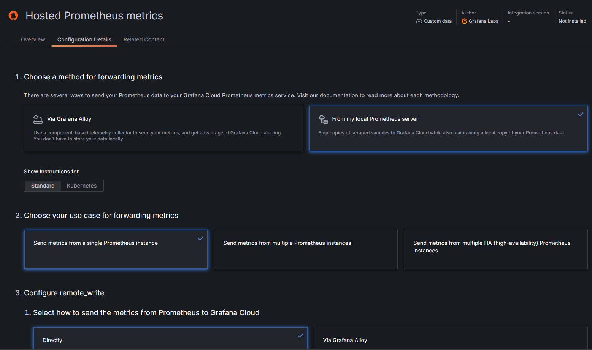
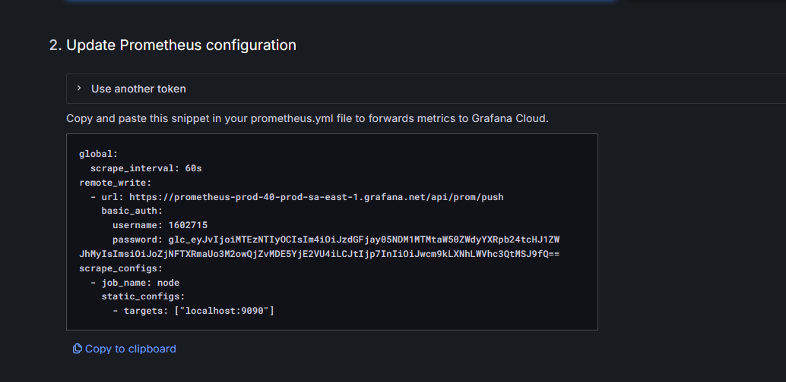

# Tema individual
* Josemaria Pérez Fernández

## 1. Tema
Observación y monitoreo
## 2. Desarrollo Conceptual
La observación y monitoreo de aplicaciones y servicios es crucial para garantizar el rendimiento, la disponibilidad y la detección temprana de problemas. Prometheus es una herramienta de monitoreo de código abierto que recopila métricas y proporciona potentes capacidades de consulta. Grafana es una plataforma de visualización que se integra con Prometheus para crear dashboards interactivos.


## 3. Consideraciones Tecnicas 
### 3.1 Instalación / Configuración de Servicio
#### 3.1.1 Instalar el paquete en nuestro proyecto
Es necesario descargar el paquete de prometheus en nuestro proyecto.
Con ello podemos acceder a las herramientas que este nos ofrece
#### 3.1.2 Configuración de nuestra aplicación
Una vez se cuenta con el paquete necesario, vamos a configurar nuestra aplicacion usando las herramientas de prometheus ofrece, estas deben estar dirigidas a medir el rendimiento, disponibilidad y detección temprana de problemas
#### 3.1.3 Configuración de Prometheus:
Descargar e instalar Prometheus desde la página oficial.
Configurar prometheus.yml para scrapeo las métricas locales y enviar las métricas a Grafana Cloud.

#### 3.1.4 Configuración de Grafana Cloud:
Descargar grafana o entrar a Grafana Cloud y iniciar sesión con nuestro correo para poder conectarnos a prometheus luego.
### 3.2 Primeros pasos
### 3.2.1 Instalar paquetes necesarios
Comenzamos instalando el paquete de prometheus en nuestro proyecto, en nuestro caso es en .net Core por lo que instalamos mediante la consola:
``` yml
"Install-Package prometheus-net.AspNetCore"
```
### 3.2.2 Configurar nuestra aplicación
Para ello mostraremos un ejemplo en donde mediremos la cantidad de solicitudes que se le hace a un servicio de nuestra aplicación.
``` yml
private static readonly Counter ListarMaestrosCounter = Metrics.CreateCounter("calendario_listar_maestros_total", "Total de solicitudes para listar maestros");
private static readonly Histogram ListarMaestrosDuration = Metrics.CreateHistogram("calendario_listar_maestros_duration_seconds", "Duración de solicitudes para listar maestros en segundos");


[HttpGet]
[Route("listarMaestros")]
public async Task<IActionResult> ListarMaestros()
{
    ListarMaestrosCounter.Inc(); // Incrementar el contador de solicitudes
    using (ListarMaestrosDuration.NewTimer()) // Medir la duración de la solicitud
    {
        try
        {
            var principal = User;
            var validToken = HelperToken.LeerToken(principal);
            if (validToken.codigo != 1)
            {
                return Unauthorized(new { Message = "No se pudo validar el token." });
            }

            var respuesta = await _calendarioBO.ListarMaestrosCalendario();
            _log.LogInformation("{ListarMaestrosCalendario} Response: " + JsonSerializer.Serialize(respuesta));
            if (respuesta != null)
            {
                if (respuesta.codigoRes == HttpStatusCode.OK)
                {
                    return Ok(new { Message = respuesta.mensajeRes, data = respuesta.Data });
                }
                return StatusCode((int)respuesta.codigoRes, new { MessageError = respuesta.mensajeRes, MessageUser = "No se obtuvo datos del listar maestros." });
            }
            else
            {
                return StatusCode((int)HttpStatusCode.InternalServerError, new { MessageError = "Error interno en el servicio de listar maestros.", MessageUser = "Error. Vuelva a intentarlo." });
            }
        }
        catch (Exception ex)
        {
            _log.LogError("{ListarMaestros} Error: " + ex.ToString());
            return StatusCode((int)HttpStatusCode.InternalServerError, new { MessageError = "Error interno en el servicio de listar maestros.", MessageUser = "Error al cargar. Vuelva a intentarlo." });
        }
        finally
        {
            DisposeResources();
        }
    }
}
``` 
En este servicio podemos observar que se esta utilizando la métrica de contar cuantas solicitudes se hacen a esta petición, esto nos puede servir para medir el rendimineto ademas de hallar un posible cuello de botella existente en nuestro sistema.
### 3.2.3 Configurar nuestro prometheus
Configurar prometheus.yml para scrapeo las métricas locales y enviar las métricas a Grafana Cloud.
``` yml
global:
  scrape_interval: 60s
  
remote_write:
  - url: https://prometheus-prod-40-prod-sa-east-1.grafana.net/api/prom/push
    basic_auth:
      username: YOUR_USERNAME_HERE
      password: YOUR_API_TOKEN_HERE
alerting:
  alertmanagers:
    - static_configs:
        - targets:

rule_files:
  # - "first_rules.yml"
  # - "second_rules.yml"


scrape_configs:
  - job_name: "prometheus"


    static_configs:
      - targets: ["localhost:9090"]


  - job_name: "calendario_api"
    scheme: https
    tls_config:
      insecure_skip_verify: true
    static_configs:
      - targets: ["localhost:7191"]
    metrics_path: /metrics
``` 
### 3.2.3 Configurar Grafana Cloud
Crear una cuenta en Grafana Cloud.
Obtener las credenciales (username y API token) para la integración de Prometheus.
Configurar prometheus.yml con las credenciales de Grafana Cloud.
Para lograr ello primero debemos seleccionar la opcion de conexiones y marcar estas opciones para conectarlo a nuestra aplicacion desplegada en nuestro localhost.

Finalmente debemos crear un nuevo token, le asignamos un nombre y presionamos crear, este nos dará un codigo listo para pegarlo directamente en nuestra configuración del prometheus.


### Video de demostración
Todo estos pasos se detallan de manera detallada en el siguiente video:
Ojo: En la primera parte del video se detalla la visualización de Logs, y en la segunda sección, el monitoreo de aplicaciones.
https://youtu.be/8QBHVHBoPB4